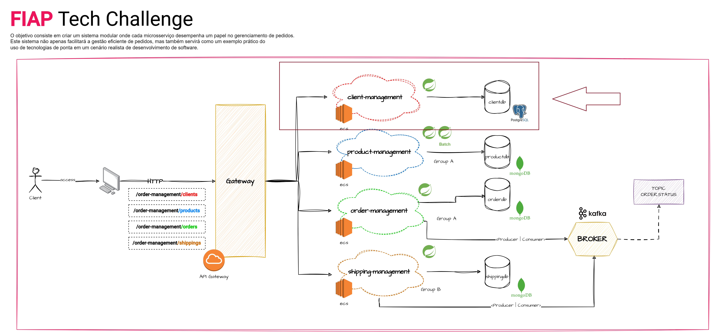
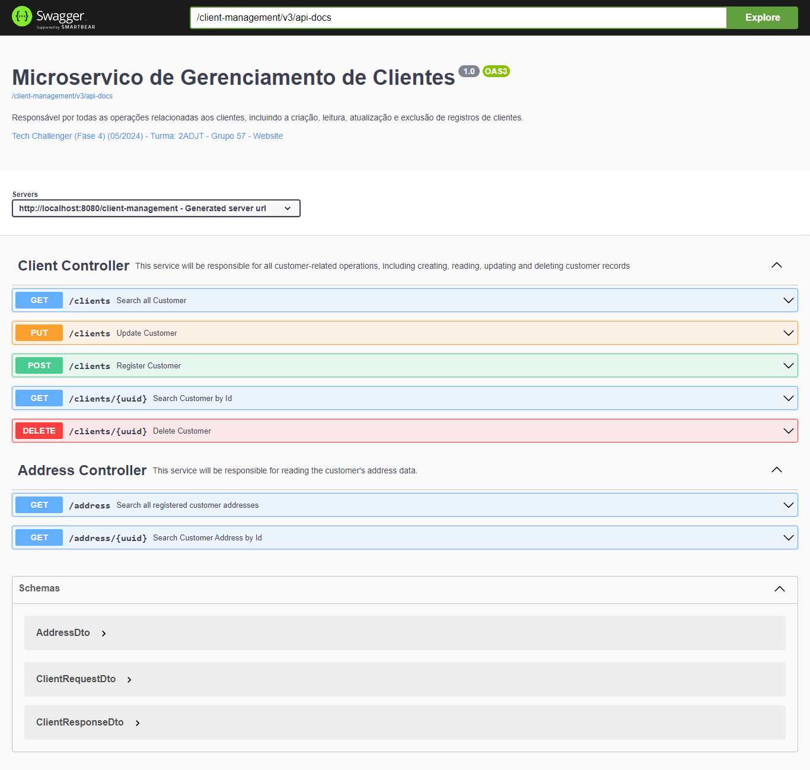

# ⭐ FIAP - Pós Tech (Fase 4) - **Sistema de Gestão de Pedidos - API de Gerenciamento de Clientes**

---

## 💥 Descrição:
- O projeto "Gerenciamento de Clientes" é uma das APIs que fazem parte do projeto completo (Sistema de Gestão de Pedidos) e servirão como critério de avaliação na 4ª fase da pós tech FIAP.

## 🛠️ Funcionalidades:

- **CRUD Clientes**
    - Esse micro serviço será responsável por todas as operações relacionadas aos clientes.
    - Trabalhará em conjuntos com os outros Microserviços, em especial com o de gerenciamento de pedidos.

- **Lista todos os clientes**
    - Retorna todos os clientes registrados

- **Retorna um cliente pelo seu identificador**
    - Dado um código de cliente e retorna seu cadastro completo.

- **Remove um cliente pelo seu identificador**
    - Dado um código de cliente o remove da base de dados.
  
- **Atualiza um cliente pelo seu identificador**
  - Dado um código de cliente atualiza seu registro na base de dados.

- **Retorno um endereço pelo seu identificador**
    - Dado um código do endereço do cliente retorna seu cadastro.

- **Retorno todos os endereços pelo**
    - Retorna todos os endereços cadastrados.
  

## 🚀 Sobre a Aplicação
- **Desenvolvida utilizando boas práticas de “Clean code”, com arquitetura em camadas (MVC) aplicada**
- **Cobertura de testes unitários**

## 🛠️ Repositório
- ####  https://github.com/brunolimadev/fiap-tc4-client-management

## 🚀 Tecnologias Utilizadas
- **Spring Boot:** versão 3.2.5
- **Java:** versão 17
- **H2 database:** versão 2.2.224
- **Springdoc-openapi-Swagger:** versão 2.5.0
- **Lombok:**  versão 1.18.32
- **JUnit:** versão: 5.10.2

## 🛠️ Ferramentas Utilizadas
- [GitHub](https://github.com/)
- [IntelliJ IDEA](https://www.jetbrains.com/idea/)
- [Postman](https://www.postman.com/)
- [Draw.io](https://app.diagrams.net/)

## 📋 Swagger

- http://localhost:8080/client-management/swagger-ui/index.html#

## 😎 Collection para testes
- [fiap-product-manager.postman_collection.zip](https://github.com/brunolimadev/fiap-tc4-client-management/blob/develop/api-test-files/fiap-client-manager.postman_collection.zip?raw=true)

## ⭐ Squad
- **Grupo 57:**
    - Bruno Rafael de Lima da Rocha
    - Eric Leonardo Santos Rangel
    - Wiliam Nascimento da Silva
    - Lucas Aparecido da Silva Mantovani